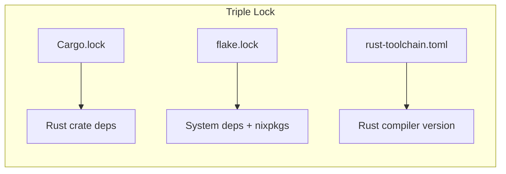

# flake.lock Committed to Version Control

## Description
`flake.lock` SHALL be committed and reviewed like any source file. It is the cryptographic merkle root of ALL transitive dependencies in the environment.

## When to Load
Load this skill when setting up a new project, reviewing PRs that update `flake.lock`, or auditing dependency pinning.

## Source
STANDARDS.adoc §1.5 (lines 932–939), §1.5.3 (lines 1011–1029), §1.2 (lines 649–655)

## Key Rules

- **MANDATE**: `flake.lock` SHALL be committed to version control.
- **MANDATE**: `flake.lock` SHALL be reviewed like any source file in PRs.
- **MANDATE**: CI SHALL fail if `nix flake check` reports any issue.
- **SHOULD**: Run `nix flake update` in a dedicated commit, not mixed with code changes.
- **SHOULD**: Pin `flake.lock` changes with a descriptive commit message (e.g., "chore(deps): update nixpkgs to 2025-01-15").

## What flake.lock Pins

| Lock Entry | What It Pins |
|---|---|
| `nixpkgs` | Full nixpkgs revision (every package version, every configuration) |
| `fenix` | Fenix revision (Rust toolchain builder) |
| `crane` | Crane revision (Rust build helper) |
| `flake-utils` | flake-utils revision (utility functions) |

The `flake.lock` file records the exact Git revision and nar hash of every input:

```json
"nixpkgs": {
    "locked": {
        "lastModified": 1734567890,
        "narHash": "sha256-abc123...",
        "owner": "NixOS",
        "repo": "nixpkgs",
        "rev": "a1b2c3d4e5f6...",
        "type": "github"
    },
    "original": {
        "owner": "NixOS",
        "repo": "nixpkgs",
        "type": "github"
    }
}
```

## Triple Lock Strategy



| Lock File | What It Pins | Update Command |
|---|---|---|
| `Cargo.lock` | Rust crate dependency tree | `cargo update` |
| `flake.lock` | nixpkgs revision, fenix, crane | `nix flake update` |
| `rust-toolchain.toml` | Rust compiler + component versions | Manual edit |

Together, these three files provide a complete, reproducible, auditable environment.

## Related Skills
- [rust-toolchain-toml](file://.opencode/skills/rust-toolchain-toml.md)
- [rust-nix-flake-structure](file://.opencode/skills/rust-nix-flake-structure.md)
- [rust-nix-flake-check](file://.opencode/skills/rust-nix-flake-check.md)
- [rust-cargo-install-locked](file://.opencode/skills/rust-cargo-install-locked.md)
